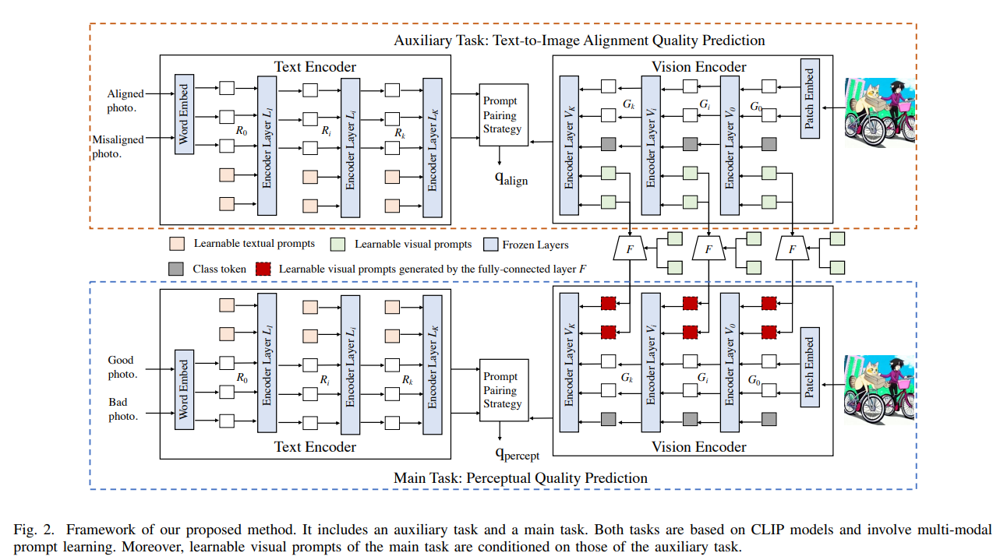

# Vision-Language Consistency Guided Multi-modal Prompt Learning for Blind AI Generated Image Quality Assessment

## Introduction
In this letter, we propose vision-language consistency guided multi-modal prompt learning for blind AGIQA, dubbed CLIP-AGIQA. Specifically, we introduce learnable textual and visual prompts in language and vision branches of CLIP models, respectively. Moreover, we design a text-to-image alignment quality prediction task, whose learned vision-language consistency knowledge is used to guide the optimization of the above multi-modal prompts. 



## Train and Test
First, download datasets [AGIQA3k](https://drive.google.com/file/d/1zpIuzdiPk5PIPdpXrfZb3Xq09PpJ-8iO/view?usp=drive_link) and [AGIQA2023](https://drive.google.com/file/d/1P91jp6D0LzEx1Y3Cu0M0AqIU3GlvR8ML/view?usp=drive_link).

Second, update path of datasets defined in ```train_test_clip_auxiliary.py```

```
path = {
    'AGIQA3k': '/home/fujun/datasets/iqa/AGIQA-3K',
    'AGIQA2023': '/home/fujun/datasets/iqa/AIGC2023/DATA/'
}
```

Third, train and test the model using the following command:
```
python train_test_clip_auxiliary.py --dataset AGIQA3k --model AGIQA
```
Finally, check the results in the folder `./log`.

## Acknowledgement
This project is based on [MaPLe](https://github.com/muzairkhattak/multimodal-prompt-learning), [DBCNN](https://github.com/zwx8981/DBCNN-PyTorch), and [CLIP-IQA](https://github.com/IceClear/CLIP-IQA). Thanks for these awesome works.

## Citation
Please cite the following paper if you use this repository in your reseach.
```
@article{fu2024vision,
  title={Vision-Language Consistency Guided Multi-modal Prompt Learning for Blind AI Generated Image Quality Assessment},
  author={Fu, Jun and Zhou, Wei and Jiang, Qiuping and Liu, Hantao and Zhai, Guangtao},
  journal={IEEE Signal Processing Letters},
  year={2024},
  publisher={IEEE}
}
```
## Contact
For any questions, feel free to contact: `fujun@mail.ustc.edu.cn`
